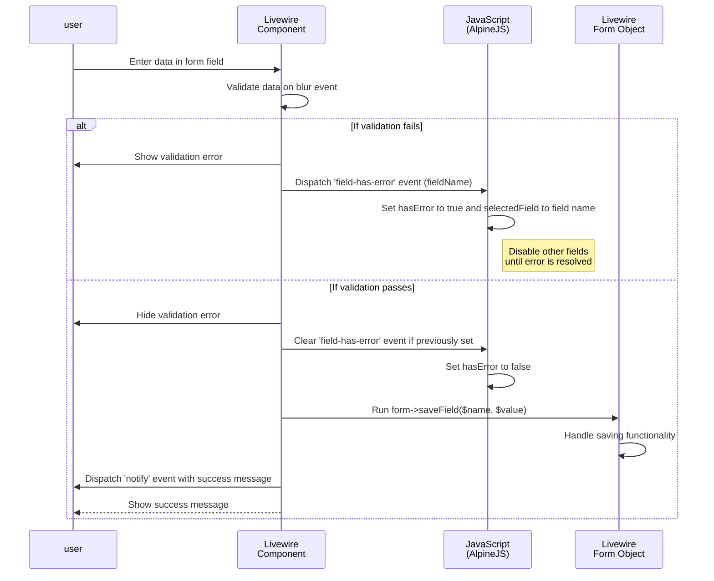

```mermaid
sequenceDiagram
    participant user
    participant component as Livewire <br>Component
    participant alpine as JavaScript <br>(AlpineJS)
    participant form as Livewire <br>Form Object

    user->>component: Enter data in form field
    component->>component: Validate data on blur event

    alt If validation fails
        component->>user: Show validation error
        component->>alpine: Dispatch 'field-has-error' event (fieldName)
        alpine->>alpine: Set hasError to true and selectedField to field name

        Note right of alpine: Disable other fields <br>until error is resolved

    else If validation passes
        component->>user: Hide validation error
        component->>alpine: Clear 'field-has-error' event if previously set
        alpine->>alpine: Set hasError to false
        component->>form: Run form->saveField($name, $value);
        form->>form: Handle saving functionality
        component->>user: Dispatch 'notify' event with success message
        component-->>user: Show success message
    end
```
