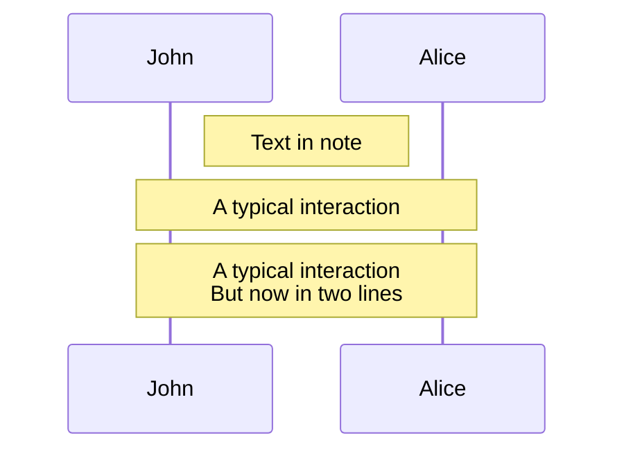
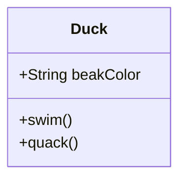
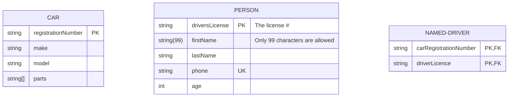
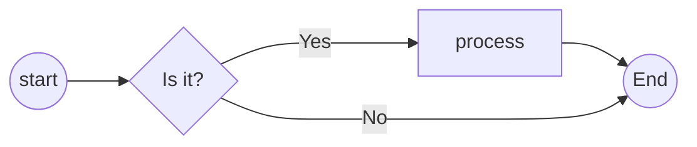
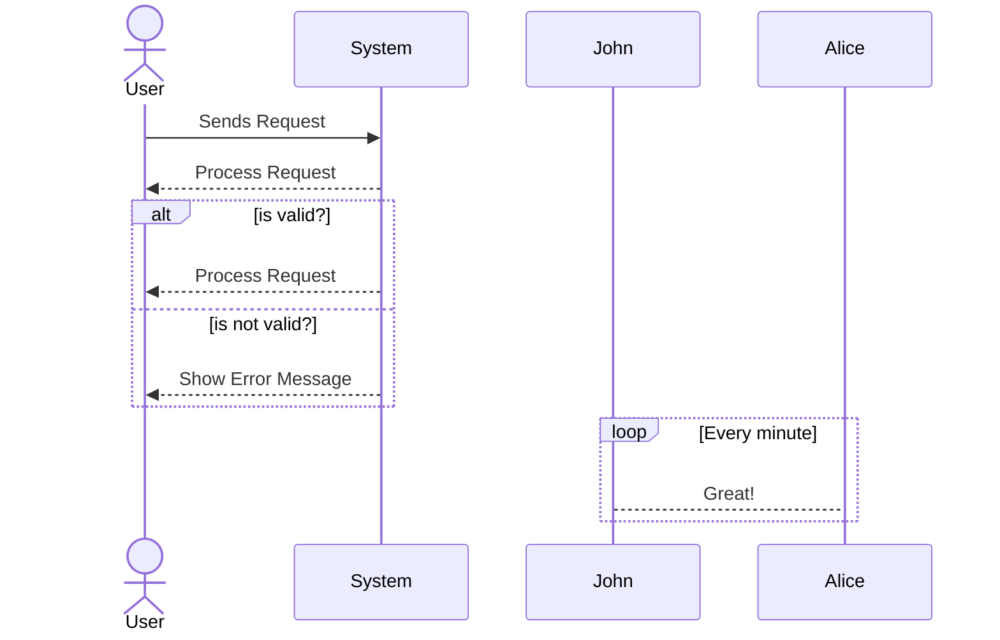

# MermaidJs Cheatsheet

- [Quick Reference](#quick-reference)
    - [Notes](#notes)
- [Class Diagram](#class-diagram)
- [Entity Relationship Diagram](#entity-relationship-diagram)
- [Flow Chart](#flow-chart)
    - [Add Option Diamond](#add-option-diamond)
- [Sequence Diagram](#sequence-diagram)

## Quick Reference

<a href="https://jojozhuang.github.io/tutorial/mermaid-cheat-sheet/" target="blank">https://jojozhuang.github.io/tutorial/mermaid-cheat-sheet/</a>

### Notes

```
Note right of John: Text in note
Note over Alice,John: A typical interaction
Note over Alice,John: A typical interaction<br/>But now in two lines
```



## Class Diagram

```
classDiagram
    class Duck{
        +String beakColor
        +swim()
        +quack()
    }
```
    


## Entity Relationship Diagram
```
erDiagram
    CAR {
        string registrationNumber PK
        string make
        string model
        string[] parts
    }
    PERSON {
        string driversLicense PK "The license #"
        string(99) firstName "Only 99 characters are allowed"
        string lastName
        string phone UK
        int age
    }
    NAMED-DRIVER {
        string carRegistrationNumber PK, FK
        string driverLicence PK, FK
    }
```
    


## Flow Chart

``` bash
---
title: Diagram Title
---
flowchart TD
    start((start)) --> B{Is it?}
    B -->|Yes| C[OK]
    C --> D[Rethink]
    D --> B
    B ---->|No| END((End))
```

```mermaid +parse-mermaid
    ---
    title: Diagram Title
    ---
    flowchart LR
        start((start)) --> B{Is it?}
        B -->|Yes| C[OK]
        C --> D[Rethink]
        D --> B
        B ---->|No| END((End))
```  

### Add Option Diamond

``` bash
flowchart LR
    start((start)) --> option{Is it?}
    option -->|Yes| process[process] --> END((End))
    option ---->|No| END((End))
```




## Sequence Diagram

```
sequenceDiagram
    actor User
    participant System
    User->>System: Sends Request

    alt is valid?
    System-->>User: Process Request
    else is not valid?
    System-->>User: Show Error Message
    end

    loop Every minute
        John-->Alice: Great!
    end
```

