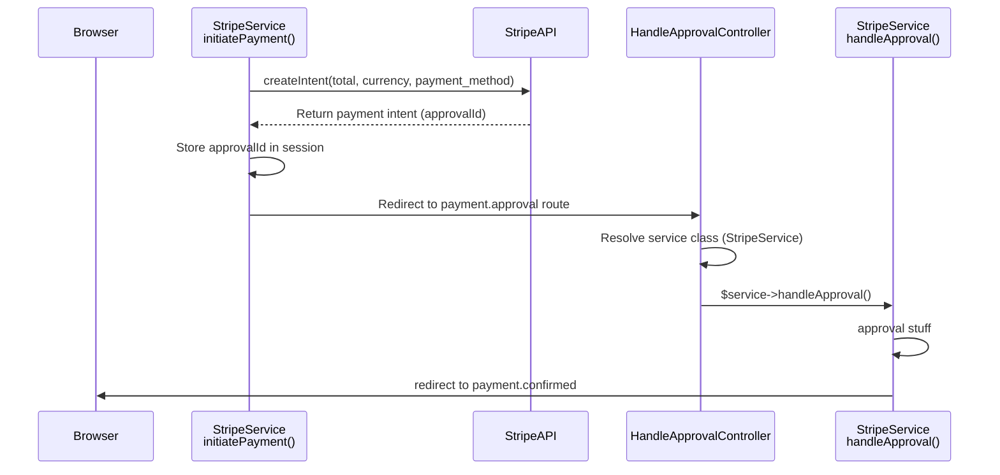
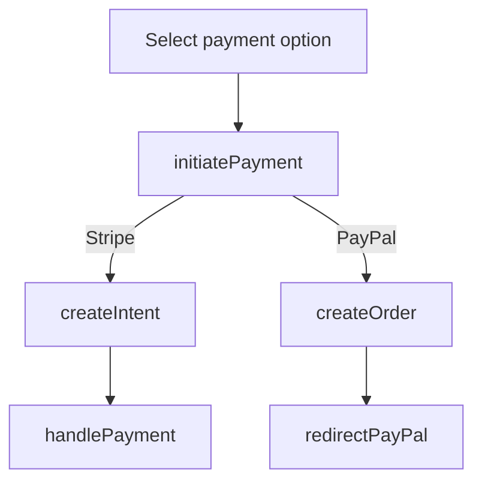
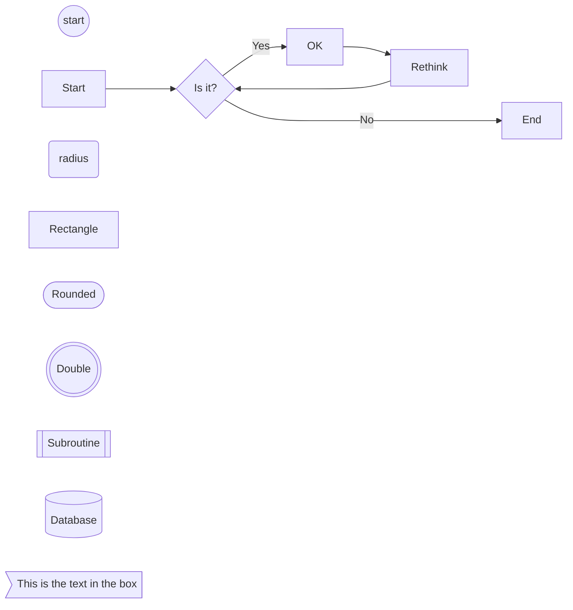

https://docs.stripe.com/payments/quickstart

- https://docs.stripe.com/payments/elements
- https://docs.stripe.com/js/element/other_element
- https://github.com/stripe/elements-examples
https://docs.stripe.com/payments/accept-a-payment?platform=web&ui=elements

1. Resolve the payment platform (paypal, stripe, etc)

-> submits form with payment id

## Add New payment method

1. Add a new payment method to the payment_methods table
2. Add the API credentials to the .env file

The user selects a payment method from the payment_methods table. The payment method is resolved to the corresponding service class using the PaymentPlatformResolver class. The service class is then used to process the payment.

### PaymentPlatformResolver

The `PaymentPlatformResolver` class is responsible for resolving the appropriate payment
service class based on a given platform ID. It enables dynamic configuration and usage of
payment platforms like PayPal and Stripe by retrieving the corresponding service class
from the application's configuration.

#### Method: `resolveService`

    public function resolveService(int $ppid)

- **Description**: Resolves and returns the class of the payment service for a given platform.
- **Parameters**:
    - `int $ppid`: The ID of the payment platform.
- **Returns**: 
    - The class string of the payment service, e.g.,
      `Naykel\Payit\Services\StripeService::class` or
      `Naykel\Payit\Services\PayPalService::class`.
- **Throws**:
    - `\Exception`: If the platform is not configured in the `payit.php` configuration file.

#### Workflow

1. Select the payment platform from the `payment-methods` component.
2. **Platform Lookup**: Fetches the `platform_name` of the payment platform corresponding
   to the provided ID, converts it to lowercase, and strips spaces.
3. **Configuration Fetch**: Uses the processed platform name to look up the service class
   in the `payit.php` configuration file.
4. **Class Resolution**: 
    - If a corresponding service class is found, it is returned.
    - If no matching service is configured, an exception is thrown.

#### Configuration Example

Ensure the `payit.php` configuration file includes entries for all supported payment
platforms. Example configuration:

    return [
        'paypal' => [
            'base_uri' => env('PAYPAL_BASE_URI'),
            'client_id' => env('PAYPAL_CLIENT_ID'),
            'client_secret' => env('PAYPAL_CLIENT_SECRET'),
            'class' => Naykel\Payit\Services\PayPalService::class,
        ],
        'stripe' => [
            'base_uri' => env('STRIPE_BASE_URI'),
            'key' => env('STRIPE_KEY'),
            'secret' => env('STRIPE_SECRET'),
            'class' => Naykel\Payit\Services\StripeService::class,
        ],
    ];

#### Usage Example

    $resolver = new \Naykel\Payit\PaymentPlatformResolver();

    // Resolve the class for a specific platform (e.g., PayPal with ID 1)
    $serviceClass = $resolver->resolveService(1);

    // Instantiate the resolved class (if needed)
    $serviceInstance = new $serviceClass();

    // Call a method on the service instance
    $serviceInstance->processPayment($paymentDetails);

This class ensures that payment platforms can be dynamically configured and easily
extended by managing service class resolution through the application's configuration
file.

### Stripe Payment Workflow

This takes place directly after the initial payment form submission when the platform has responded with a payment intent.

The `payment.approvalId` set in the session is a unique identifier returned from the
payment platform (Stripe in this case) used to confirm the payment later.

This takes place directly after the initial payment form submission when the platform has responded with a payment intent (stripe) or order (paypal).

     * Confirmed payment actions
     */
    public function confirmed()
    {
        // add order processing here!
        // override by adding payment.process route in local web.php

        return redirect()->route('user.dashboard')
            ->withSuccess('Your payment has been processed');
    }

