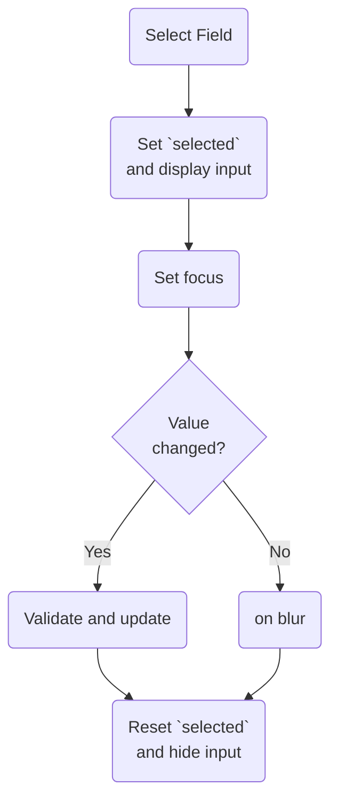

##
| Class                | Description                                                         | Example                            |
| -------------------- | ------------------------------------------------------------------- | ---------------------------------- |
| `body:dragging`      | Class added on the document body while dragging                     | `draggable--is-dragging`           |
| `container:dragging` | Class added on the container where the draggable was picked up from | `draggable-container--is-dragging` |
| `source:dragging`    | Class added on the draggable element that has been picked up        | `draggable-source--is-dragging`    |
| `source:placed`      | Class added on the draggable element on drag:stop                   | `draggable-source--placed`         |
| `container:placed`   | Class added on the draggable container element on drag:stop         | `draggable-container--placed`      |
| `draggable:over`     | Class added on draggable element you are dragging over              | `draggable--over`                  |
| `container:over`     | Class added on draggable container element you are dragging over    | `draggable-container--over`        |
| `source:original`    | Class added on the original source element, which is hidden on drag | `draggable--original`              |
| `mirror`             | Class added on the mirror element                                   | `draggable-mirror`                 |

