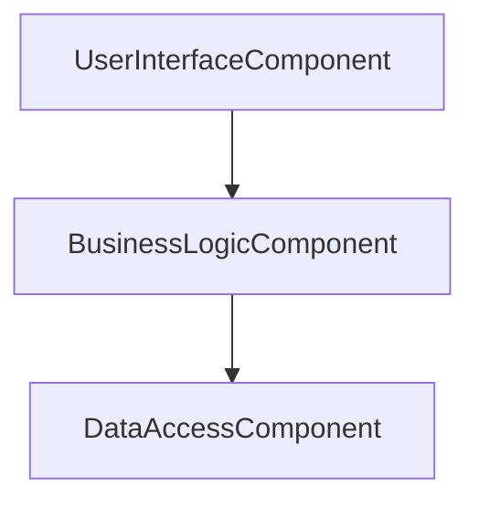
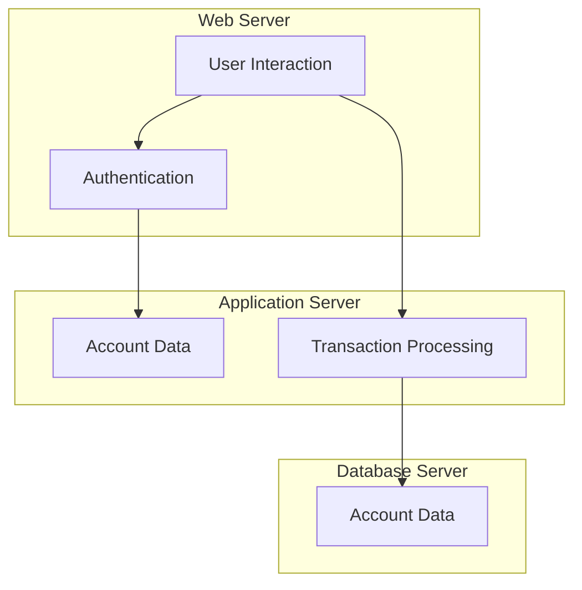
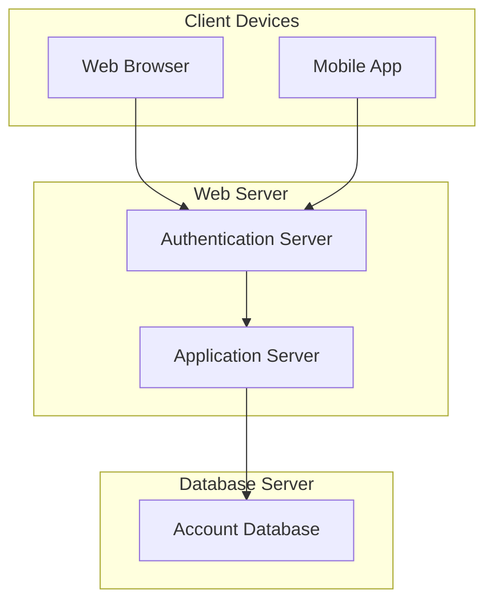
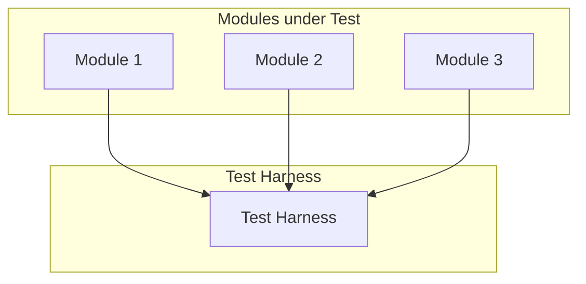
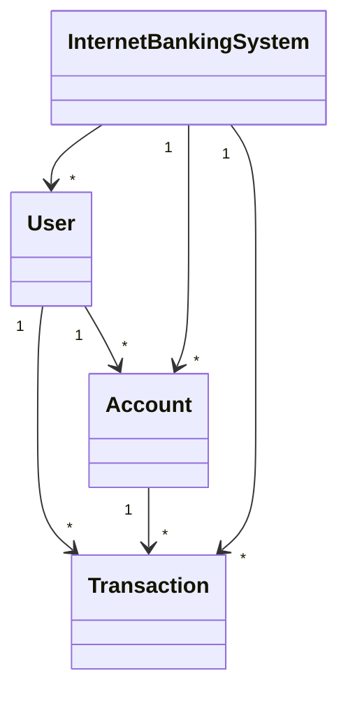

```mermaid

```

```mermaid

```

```mermaid

```

```mermaid

```

```mermaid

```

```mermaid

```

```mermaid

```

```mermaid

```



A pattern to me implies some sort of workflow or diagram (much like the observer patter), I now understand that these really are just concepts and as stated above there is no tangible way to implement them. 