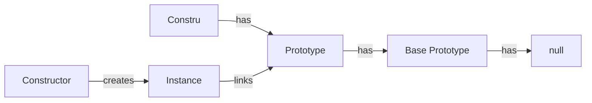

# Constructor and Prototype

- [Core Concepts](#core-concepts)
  - [Comparison of Constructor and Prototype](#comparison-of-constructor-and-prototype)

## Core Concepts

In JavaScript, every object has a prototype. The prototype is also an object. When you
create an object, JavaScript automatically assigns the prototype of the object to the
prototype of the constructor function that created the object.

1. **Constructor**: This is the function that is used to construct or create
   (initialize) the object. You can access it via `object.constructor`.<br><br>
2. **Prototype**: This is the object from which the object inherits properties and
   methods. You can access it via `Object.getPrototypeOf(object)`.<br><br>
3. **Constructor Chain**: In class-based inheritance, constructors form a lineage
   reflecting the hierarchy of classes for inheritance.<br><br>
4. **Prototype Chain**: JavaScript's inheritance mechanism. When accessing a property or
   method, JavaScript traverses the prototype chain until it finds the property or
   reaches null.


```blade +parse
<x-test/>
```

### Comparison of Constructor and Prototype

The following example demonstrates the difference between a constructor and a prototype.

<div class="compare"></div>

```js
class Person {
    constructor(name) {
        this.name = name;
    }
}

const user = new Person('Joanne');
console.log(user.name);
```
```js
function Animal(name){
    this.name = name;
}

let pet = new Animal('Fluffy');
console.log(pet.name);
```
<div class="clear"></div>

In the above example, both create objects with a `name` property. The difference is that
`Person` is a class that uses a `constructor` method to initialize its `name` property.
`Animal` is a function that uses the `this` keyword to assign its `name` property.



