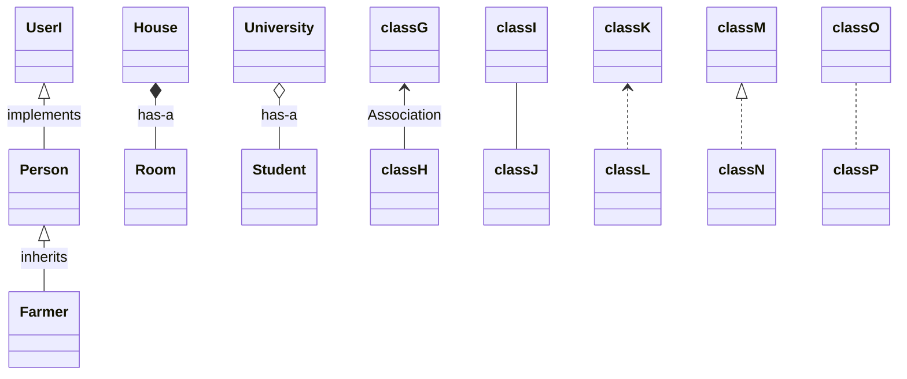
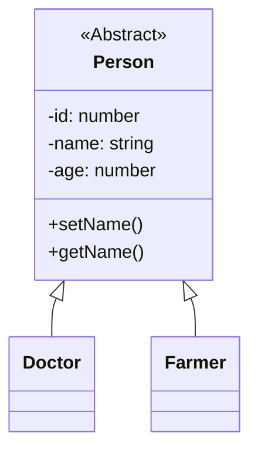
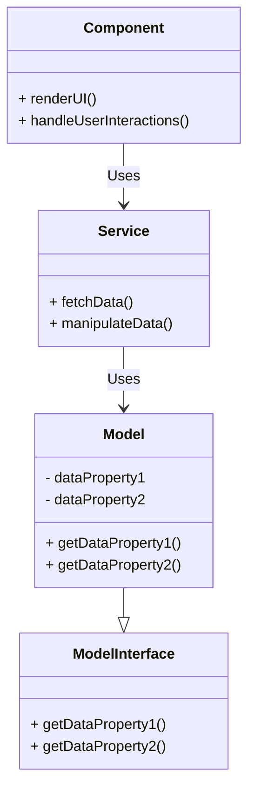

# Class Diagrams

<!-- TOC -->

- [Symbols](#symbols)
    - [Dependency (uses-a relationship)](#dependency-uses-a-relationship)
    - [Association (uses-a relationship)](#association-uses-a-relationship)
    - [Dependency vs. Association](#dependency-vs-association)
    - [Inheritance (is-a relationship)](#inheritance-is-a-relationship)
    - [Implements (interface)](#implements-interface)
    - [Implements vs. Inheritance](#implements-vs-inheritance)
    - [Composition (has-a relationship)](#composition-has-a-relationship)
    - [Aggregation (has-a relationship)](#aggregation-has-a-relationship)
- [Abstract class](#abstract-class)
- [FAQ's](#faqs)

<!-- /TOC -->

## Symbols

### Dependency (uses-a relationship)

<question></question>
What is a dependency?
<answer></answer>
A dependency is a relationship between two or more objects where an object is dependent on another
object(s) for its specification or implementation. This is represented by a dashed line.

### Association (uses-a relationship)

<question></question>
What is an association?
<answer></answer>
An association represents a relationship between two or more objects where all objects have their
own lifecycle and there is no owner. The name of an association specifies the nature of the
relationship between objects. This is represented by a solid line.

### Dependency vs. Association

<question></question>
What is the difference between a dependency and an association?
<answer></answer>

A dependency is a relationship between two or more objects where an object is dependent on another
object(s) for its specification or implementation. An association represents a relationship
between two or more objects where all objects have their own lifecycle and there

### Inheritance (is-a relationship)

<question></question>
What is inheritance?
<answer></answer>
Inheritance is a mechanism that allows a class to inherit the properties and methods of another
class. The class that inherits the properties and methods is called the subclass, and the class
whose properties and methods are inherited is called the superclass. Inheritance allows us to
reuse the code defined in other classes without having to write the code again.

For example, a doctor IS-A person, a farmer IS-A person, and a student IS-A person.

### Implements (interface)

<question></question>
What is an interface?
<answer></answer>
An interface is a contract that specifies the methods that a class must implement. An interface
can also contain constants, default methods, static methods, and nested types. An interface
cannot be instantiated directly. Its methods are implemented by a class that implements the
interface.

### Implements vs. Inheritance

<question></question>
What is the difference between implements and inheritance?
<answer></answer>
- A class can implement multiple interfaces, but a class can only inherit from one superclass.
- An interface cannot have instance variables, while a class can.
- An interface cannot have constructors, while a class can.
- An interface cannot have private methods, while a class can.
- An interface cannot have public methods, while a class can.

### Composition (has-a relationship)

<question></question>
What is composition?
<answer></answer>
The key characteristic of composition is that the part cannot exist independently without the
whole, and there is a strong ownership relationship. For example, a house has rooms, and a room is
a part of a house. A room cannot exist without a house, and if the house is destroyed, the rooms
are also destroyed.

### Aggregation (has-a relationship)

<question></question>
What is aggregation?
<answer></answer>
Aggregation is a weaker form of association where one class is associated with another class, but
there is no strong ownership. In the case of aggregation, the part can exist independently of the
whole. For example, a university is associated with students. If the university ceases to exist,
the students can still exist and attend other universities. This represents a weaker, more
flexible relationship compared to composition.

<!-- Dependency:

Sometimes, an association can represent a dependency relationship between classes, where one class relies on the other but without any structural connection. -->

---
---
---
---
---
---
---
---
---
---
---
---

<!-- classDiagram
classC --* classD : Composition
classE --o classF : Aggregation
classG --> classH :
classI -- classJ : Link(Solid)
classK ..> classL : Dependency
classM ..|> classN : Realization
classO .. classP : Link(Dashed) -->

## Abstract class

An abstract class in object-oriented programming is a class that cannot be instantiated directly
but serves as a blueprint for other classes. Abstract classes are used to define a common
interface or set of methods that must be implemented by any concrete (non-abstract) subclass.

<question></question>
Q. What is the difference between an abstract class and an interface?
<answer></answer>
- An abstract class can have instance variables, while an interface cannot.
- An abstract class can have non-abstract methods, while an interface cannot.
- An abstract class can have a constructor, while an interface cannot.
- An abstract class can have private methods, while an interface cannot.
- An abstract class can have public methods, while an interface cannot.

## FAQ's

