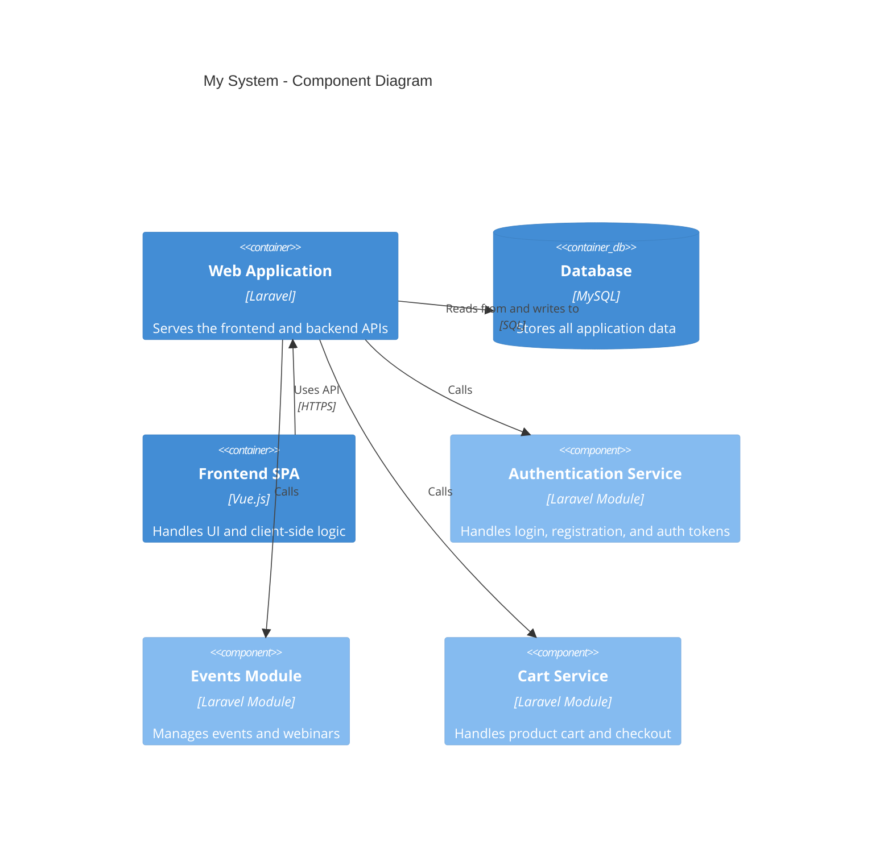

- [Introduction](#introduction)
- [Prerequisites](#prerequisites)
- [Quick Checklist](#quick-checklist)
- [Initial Setup](#initial-setup)
    - [Component Class](#component-class)
    - [Blade View](#blade-view)
- [Initialising the Form](#initialising-the-form)
    - [Route-based Initialisation (via route model binding)](#route-based-initialisation-via-route-model-binding)
    - [Event-Driven Initialisation](#event-driven-initialisation)
        - [Listening for Events](#listening-for-events)
        - [Dispatching Events](#dispatching-events)
    - [Setting Default Values](#setting-default-values)
        - [Method 1: Pass Defaults Directly](#method-1-pass-defaults-directly)
        - [Method 2: Use the `initialData` Property](#method-2-use-the-initialdata-property)
- [Still to be reviewed](#still-to-be-reviewed)
- [FAQs](#faqs)
    - [Why use the `$modelClass` property?](#why-use-the-modelclass-property)
    - [When Should I use the `initialData` Property?](#when-should-i-use-the-initialdata-property)
    - [When using events, how do i refresh a separate component?](#when-using-events-how-do-i-refresh-a-separate-component)
  
## Introduction

## Quick Checklist

1. Create the Livewire component (`php artisan livewire:make WidgetCreateEdit`)
2. Add the form object with traits and properties (`gtlc:form-class`)
3. Initialise the form object with a model instance
4. Bind the form to the view with `wire:model="form.property"`
5. Add form inputs and submit/cancel buttons
6. Test both create and edit functionality

## Initial Setup

From the command line:

```bash +torchlight-bash
php artisan livewire:make WidgetCreateEdit
```

### Component Class

Once created, update the component class to include the required traits and
properties.

```php +code
namespace App\Livewire;

use App\Livewire\Forms\WidgetFormObject;
use App\Models\Widget;
use Livewire\Component;
use Naykel\Gotime\Traits\Renderable;
use Naykel\Gotime\Traits\WithFormActions;

class WidgetCreateEdit extends Component
{
    use Renderable, WithFormActions;

    public WidgetFormObject $form;
    protected string $modelClass = Widget::class;
}
```

* `Renderable` (optional) – allows the component to render a view
* `WithFormActions` – bridges the Livewire component and a Livewire form object
* `$form` – the form object that handles form logic
* `$modelClass` – the primary model resource for CRUD operations

### Blade View

Bind inputs to the form object with `wire:model="form.property"` and handle
submit/cancel:

```html +torchlight-blade
@verbatim
<form wire:submit="save" class="bx">
    <x-gt-input wire:model="form.name" label="name" />
    <div class="tar">
        <x-gt-button wire:click="cancel" class="btn sm" text="CANCEL" />
        <x-gt-button wire:click="save" class="btn primary sm" text="SAVE" />
    </div>
</form>
@endverbatim
```

## Initialising the Form

Call the form object’s `init()` method with a model instance. Use a new instance
for creating records or an existing one for editing. The form will populate its
properties from the model, allowing direct input binding, validation, and
saving.

> Depending on your use case, you can initialise the form in different ways,
> such as via route model binding, Livewire events, or passing data from a
> parent component.

### Route-based Initialisation (via route model binding)

<!-- NK::REVIEW I am not sure this is complexly accurate  -->
When using route model binding, the model instance is passed to `mount()`. Make
the parameter optional to handle both create and edit scenarios, using
`createNewModel()` when no model is provided.

```php +code
public function mount(?Widget $Widget)
{
    $model = $Widget ?? $this->form->createNewModel();
    $this->form->init($model);
}
```

### Event-Driven Initialisation

#### Listening for Events

When using the `WithFormActions` trait, there is nothing special you need to do
to listen for events. Just make sure to use the correct event names to
communicate with the trait.

<!-- use the resource action buttons to dispatch events that the form object can listen for. -->
<!-- these use convention when communicating with the `WithFormActions` trait: -->


* `create-model`
* `delete-model`
* `edit-model`
* `model-deleted`
* `model-saved`

#### Dispatching Events

* Make sure to use the correct event names to communicate with the
  `WithFormActions` trait.
* To avoid conflicts with other components, it is best to use `dispatchTo()`
  instead of `dispatch()`. 

```php +code
@verbatim
<x-gt-button wire:click="$dispatchTo('Widget-create-edit', 'create-model')" text="Create" />
@endverbatim
```


### Setting Default Values

The `createNewModel()` method generates a new model instance for your form. It
accepts an optional array of default attributes and is provided by the
`WithFormActions` trait.

#### Method 1: Pass Defaults Directly

Specify defaults inline when creating the model:

```php +code
$model = $this->form->createNewModel(['email_verified_at' => now()]);
```

#### Method 2: Use the `initialData` Property

Set defaults on the component that the form object will merge when creating a
new model:

```php +code
public function mount(?Widget $Widget)
{
    $this->initialData = ['email_verified_at' => now(),];
    $model = $Widget ?? $this->form->createNewModel();
    $this->form->init($model);
}
```

## Still to be reviewed

* Updating table or list components after an action
* Using Modals (actionId) ???

## FAQs

### <question>Why use the `$modelClass` property?</question>

The `$modelClass` property tells the `WithFormActions` trait which Eloquent model
to use for CRUD operations. This avoids hard-coding the model type, making your
component more maintainable and reusable.

### <question>When Should I use the `initialData` Property?</question>

Use `initialData` when default values depend on Widget context, route parameters,
or other dynamic data that isn't known at compile time.

### <question>When using events, how do i refresh a separate component?</question>


<!-- REVIEW -->



