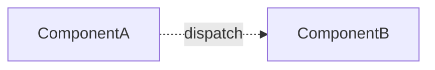
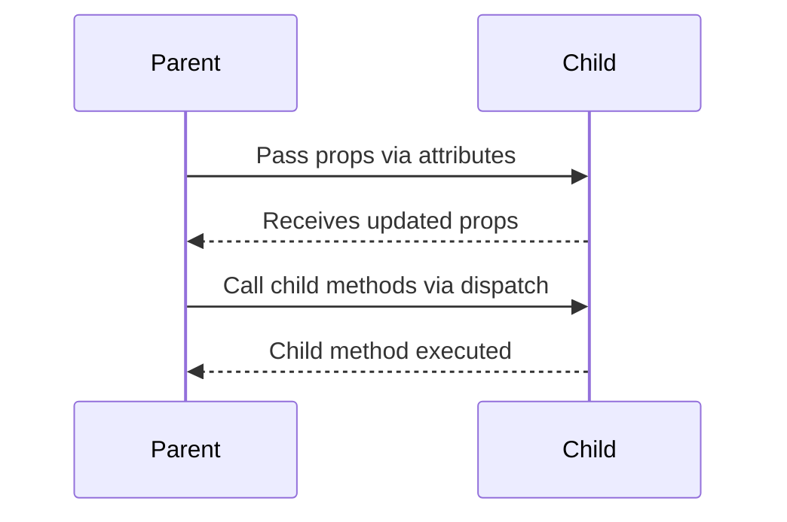
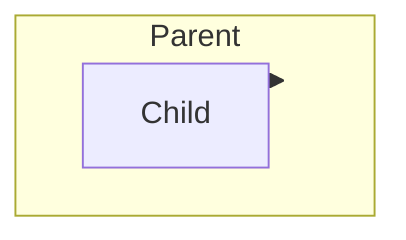
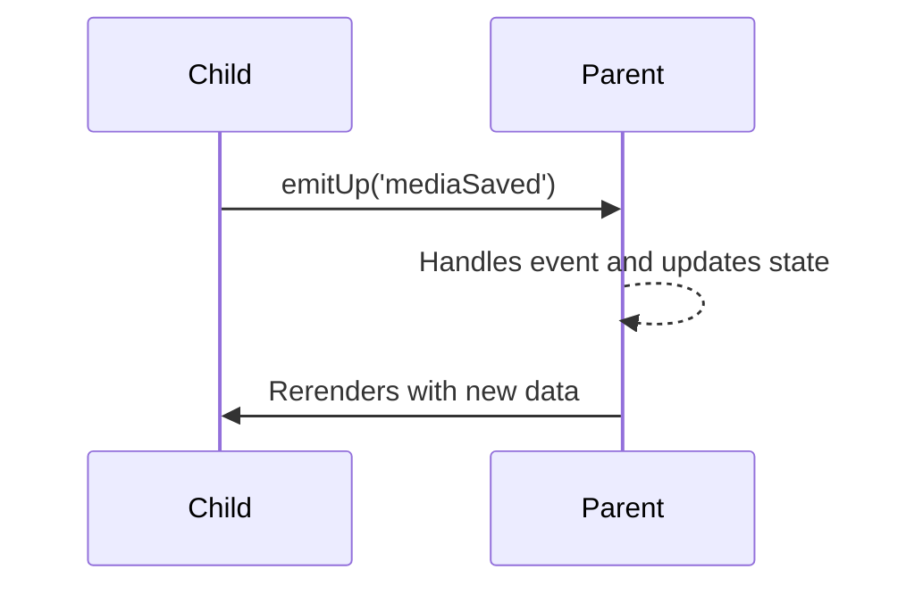

# Livewire Component Design & Communication Patterns

- [Overview](#overview)
- [Separate Components (Event-Based)](#separate-components-event-based)
- [Pattern 1 - Nested Parent → Child](#pattern-1---nested-parent--child)
- [Pattern 2 - Child → Parent](#pattern-2---child--parent)

## Overview

Livewire components can be arranged and communicate in different ways. Your
choice affects **coupling** (how tightly they depend on each other) and
**reusability** (how easily they can be reused elsewhere).

## Separate Components (Event-Based)

**Structure** 

Components are independent and communicate via events. They do not depend on
each other directly, but can listen for events emitted by others.



**Communication Flow**

```mermaid +parse-mermaid
resources/views/diagrams/livewire/independent-components-sequence-diagram.mmd
```

resources/views/diagrams/livewire/nested-parent-child-structure.mmd

**Characteristics**

* **Coupling:** Low - no direct dependency between components.
* **Reusability:** High - works anywhere if listening for correct events.
* **Good for:** Modular, reusable features that may appear in different
  contexts.


---

## Pattern 1 - Nested Parent → Child

**Structure** Parent renders child directly in its Blade view, passes data via
props, and may call child methods via `dispatch`.

```mermaid +parse-mermaid
resources/views/diagrams/livewire/nested-parent-child-structure.mmd
```

**Communication Flow**




**Characteristics**

* **Coupling:** High - child depends on parent data and lifecycle.
* **Reusability:** Low - hard to use without this parent.
* **Good for:** Tight UI integrations (e.g., form inside modal).

---

## Pattern 2 - Child → Parent

**Structure** Parent renders child, but child triggers events upward via
`emitUp` for parent to handle.



**Communication Flow**



**Characteristics**

* **Coupling:** Medium - needs a parent, but logic is more separated.
* **Reusability:** Medium - can be reused if similar parent exists.
* **Good for:** Child triggers actions but parent owns data.

---

