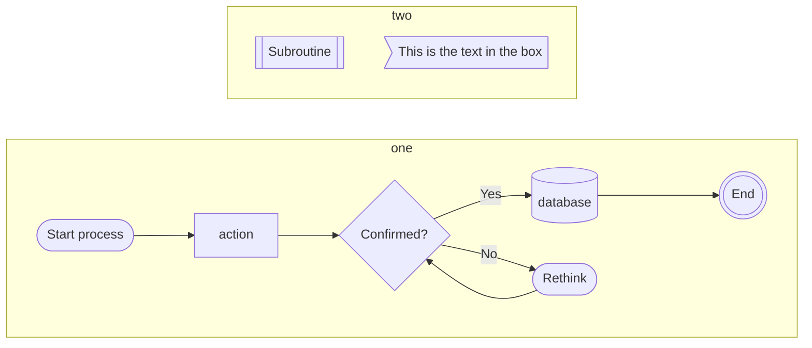
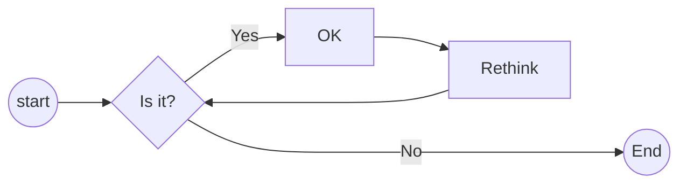
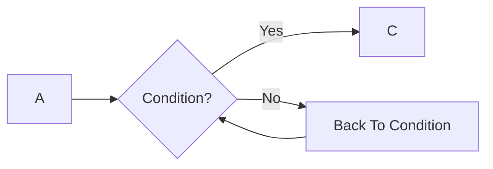
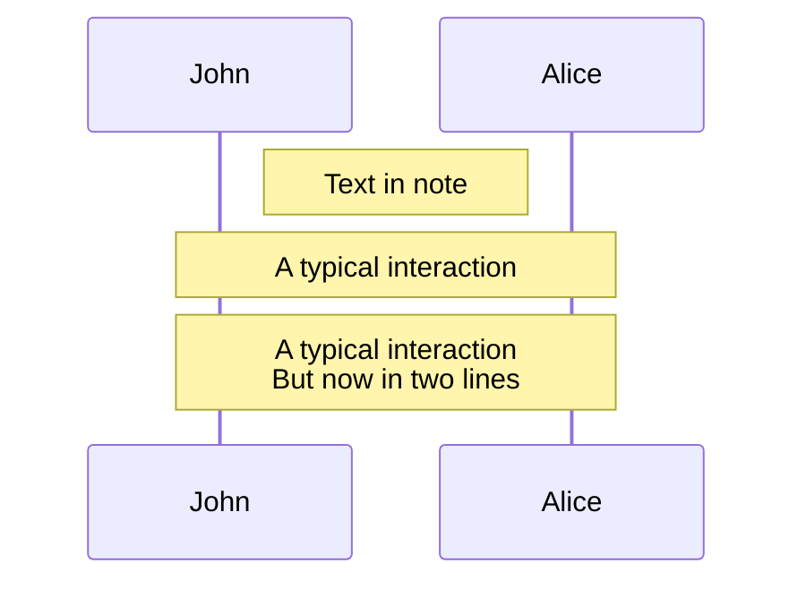
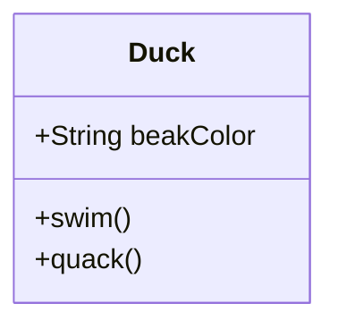
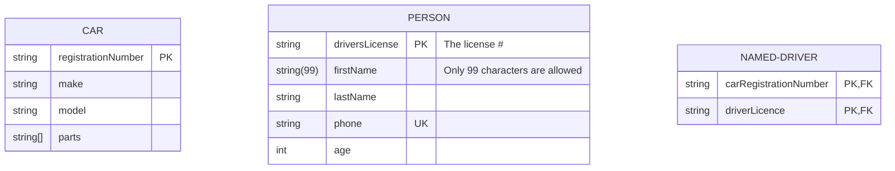
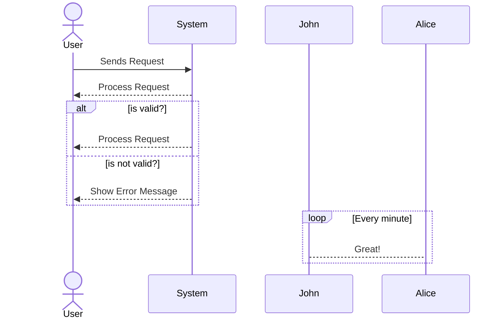
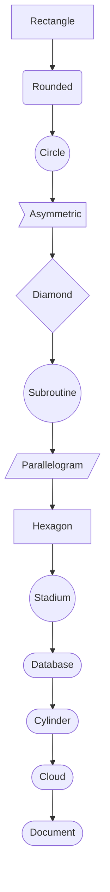

# MermaidJs Cheatsheet

- [Quick Reference](#quick-reference)
- [Flow Chart](#flow-chart)
    - [Add Option Diamond](#add-option-diamond)
- [Class Diagram](#class-diagram)
- [Entity Relationship Diagram](#entity-relationship-diagram)
- [Sequence Diagram](#sequence-diagram)
- [Mermaid Shapes Cheatsheet](#mermaid-shapes-cheatsheet)


```mermaid +parse-mermaid
./event-exam-cram-workflow.mmd
```



---
---
---
---
---
---
---
---
---
---
---
---
---
---
---
---
---
---
## Quick Reference

<a href="https://jojozhuang.github.io/tutorial/mermaid-cheat-sheet/" target="blank">https://jojozhuang.github.io/tutorial/mermaid-cheat-sheet/</a>

## Flow Chart




```bash +torchlight-bash
flowchart TD
    start((start)) --> B{Is it?}
    B -->|Yes| C[OK]
    C --> D[Rethink]
    D --> B
    B ---->|No| END((End))
```

### Add Option Diamond





```bash +torchlight-bash
flowchart LR
    A --> B{Condition?}
    B -->|Yes| C
    B -->|No| D[Back To Condition] --> B
```


---
---
---
---
---
---


```mermaid +parse-mermaid
flowchart LR
    start((start)) --> option{Is it?}
    option -->|Yes| process[process] --> END((End))
    option ---->|No| END((End))
``` -->


---
### Notes

```
Note right of John: Text in note
Note over Alice,John: A typical interaction
Note over Alice,John: A typical interaction<br/>But now in two lines
```



## Class Diagram

```
classDiagram
    class Duck{
        +String beakColor
        +swim()
        +quack()
    }
```
    


## Entity Relationship Diagram
```
erDiagram
    CAR {
        string registrationNumber PK
        string make
        string model
        string[] parts
    }
    PERSON {
        string driversLicense PK "The license #"
        string(99) firstName "Only 99 characters are allowed"
        string lastName
        string phone UK
        int age
    }
    NAMED-DRIVER {
        string carRegistrationNumber PK, FK
        string driverLicence PK, FK
    }
```
    



## Sequence Diagram

```
sequenceDiagram
    actor User
    participant System
    User->>System: Sends Request

    alt is valid?
    System-->>User: Process Request
    else is not valid?
    System-->>User: Show Error Message
    end

    loop Every minute
        John-->Alice: Great!
    end
```



## Mermaid Shapes Cheatsheet



| Syntax                | Shape         | Example           |
|-----------------------|--------------|-------------------|
| `A[Rectangle]`        | Rectangle    | Rectangle         |
| `B(Rounded)`          | Rounded      | Rounded           |
| `C((Circle))`         | Circle       | Circle            |
| `D>Asymmetric]`       | Asymmetric   | Asymmetric        |
| `E{Diamond}`          | Diamond      | Diamond           |
| `F((Subroutine))`     | Subroutine   | Subroutine        |
| `G[/Parallelogram/]`  | Parallelogram| Parallelogram     |
| `H["Hexagon"]`        | Hexagon      | Hexagon           |
| `I((Stadium))`        | Stadium      | Stadium           |
| `J([Database])`       | Database     | Database          |
| `K([Cylinder])`       | Cylinder     | Cylinder          |
| `L([Cloud])`          | Cloud        | Cloud             |
| `M([Document])`       | Document     | Document          |

- Use different brackets to create different shapes:
  - `[text]` Rectangle
  - `(text)` Rounded
  - `((text))` Circle
  - `>text]` Asymmetric
  - `{text}` Diamond
  - `((text))` Subroutine
  - `[/text/]` Parallelogram
  - `["text"]` Hexagon
  - `((text))` Stadium
  - `([text])` Database
  - `([text])` Cylinder
  - `([text])` Cloud
  - `([text])` Document